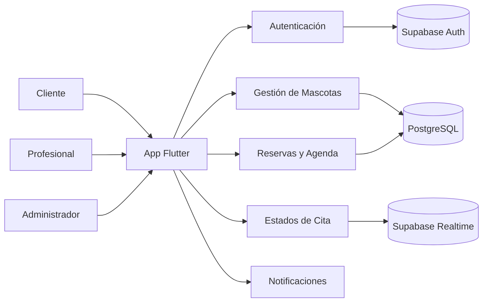

# PetAppointment

Sistema móvil para gestión de citas veterinarias y peluquería de mascotas.


## Información Institucional

| Campo | Detalle |
|---|---|
| Proyecto | PetAppointment - Sistema de Citas Veterinarias |
| Tipo | Proyecto Universitario de Desarrollo Móvil |
| Universidad | Universidad del Valle |
| Facultad | Ingeniería |
| Programa | Tecnología en Desarrollo de Software |
| Asignatura | Desarrollo de Aplicaciones para Dispositivos Móviles |
| Docente | Quintero Capera Daniel |

### Integrantes

| Nombre | Código | Rol |
|---|---|---|
| Nicolas Gonzalez Giraldo | 202369659 | Desarrollador Flutter / Líder Técnico |
| Luis Carlos Pedraza Corredor | 202369678 | Desarrollador Flutter / Diseño UI/UX |
| Luis Carlos Pedraza Corredor | 202369678 | Integración Supabase / Base de Datos |

## Diagrama del Proyecto



## Visión del Proyecto

PetAppointment busca digitalizar el proceso de reserva y seguimiento de citas para clínicas veterinarias y servicios de grooming, ofreciendo una experiencia clara tanto para dueños de mascotas como para personal profesional y administración.

## Estado Actual

El proyecto está en fase inicial: base Flutter creada, documentación técnica organizada y preparación para comenzar la implementación funcional.

## Estado por Módulo

| Módulo | Estado | Observación |
|---|---|---|
| Autenticación | Planeado | Pendiente de implementación con Supabase Auth |
| Gestión de Mascotas | Planeado | CRUD aún no iniciado |
| Servicios y Catálogo | Planeado | Definición funcional en documentación |
| Citas y Agenda | Planeado | Flujo descrito, sin desarrollo en código |
| Estados de Cita | Planeado | Diseño funcional definido |
| Notificaciones | Planeado | Integración pendiente |
| Backend Supabase | Planeado | Conexión aún no implementada |
| Pruebas | En progreso | Base de pruebas Flutter disponible |
| Documentación | En progreso | Estructura modular creada |

## Gestión del Proyecto (Jira)

- Tablero Jira del equipo: [KAN - PetAppointment](https://correounivalle-team-f1bug4uj.atlassian.net/jira/software/projects/KAN/summary?atlOrigin=eyJpIjoiNTdhN2VhOTVjNjJiNDFlOGE0MTdmNzAwZjQ2MmM5YTciLCJwIjoiaiJ9)

## Ramas Oficiales (Entrega 1)

- master: base solicitada por el docente para control principal.
- qa: integración de desarrollo.
- staging: pruebas previas a entrega.

## Funcionalidades Objetivo

- Registro e inicio de sesión por roles.
- Gestión de mascotas y servicios.
- Reserva, reprogramación y cancelación de citas.
- Agenda y seguimiento de estados de atención.
- Integración backend con Supabase (planeado).

## Stack Tecnológico

- Flutter
- Dart
- Supabase (planeado)
- PostgreSQL (vía Supabase)

## Estructura del Repositorio

- lib/: código fuente de la aplicación.
- test/: pruebas automatizadas.
- docs/: documentación técnica modular y guía visual.
- android/, ios/, web/, windows/, macos/, linux/: plataformas de ejecución.

## Inicio Rápido

1. Instala Flutter SDK y valida tu entorno.
2. Descarga dependencias.
3. Ejecuta la app.
4. Corre análisis y pruebas.

```bash
flutter pub get
flutter run
flutter analyze
flutter test
```

## Documentación

- Índice principal: [docs/README.md](docs/README.md)
- Documento de Entrega 1: [docs/Entrega_1_Primer_Adelanto.md](docs/Entrega_1_Primer_Adelanto.md)
- Documento técnico completo: [docs/PetAppointment_Documentacion_Tecnica.md](docs/PetAppointment_Documentacion_Tecnica.md)
- Guía de estilo visual: [docs/STYLE_GUIDE.md](docs/STYLE_GUIDE.md)
- Secciones de documentación:
	- [1. Visión General, Contexto y Objetivos](docs/secciones/01-vision-general-contexto-objetivos.md)
	- [2. Alcance Funcional Inicial](docs/secciones/02-alcance-funcional-inicial.md)
	- [3. Roles del Sistema](docs/secciones/03-roles-del-sistema.md)
	- [4. Diagramas](docs/secciones/04-diagramas.md)
	- [5. Épicas, Historias de Usuario y Tareas Técnicas](docs/secciones/05-epicas-historias-y-tareas-tecnicas.md)
	- [6. Stack Tecnológico Detallado](docs/secciones/06-stack-tecnologico-detallado.md)
	- [7. Arquitectura Técnica](docs/secciones/07-arquitectura-tecnica.md)
	- [8. Automatización con Supabase](docs/secciones/08-automatizacion-con-supabase.md)
	- [9. Puesta en Marcha y Workflow Recomendado](docs/secciones/09-puesta-en-marcha-y-workflow.md)
	- [10. Manual de Usuario](docs/secciones/10-manual-de-usuario.md)
	- [11. Plan de Pruebas](docs/secciones/11-plan-de-pruebas.md)
	- [12. Riesgos y Mitigaciones](docs/secciones/12-riesgos-y-mitigaciones.md)
	- [13. Requisitos No Funcionales](docs/secciones/13-requisitos-no-funcionales.md)
	- [14. Roadmap y Futuras Mejoras](docs/secciones/14-roadmap-y-futuras-mejoras.md)

## Equipo

Proyecto académico universitario en evolución.

## Licencia

Este proyecto se distribuye bajo la licencia incluida en [LICENSE](LICENSE).
