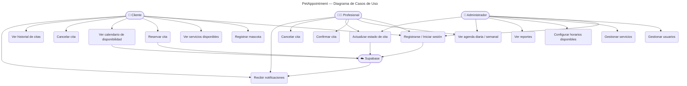
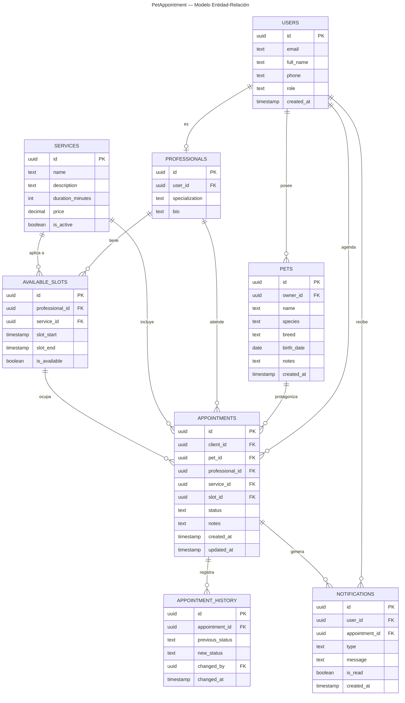
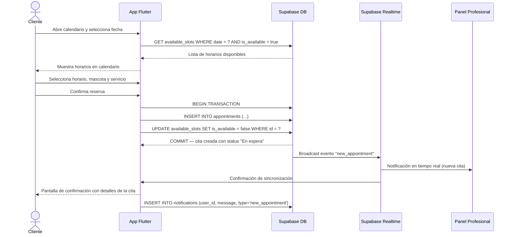
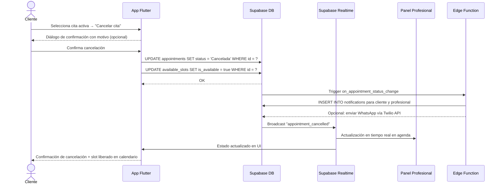
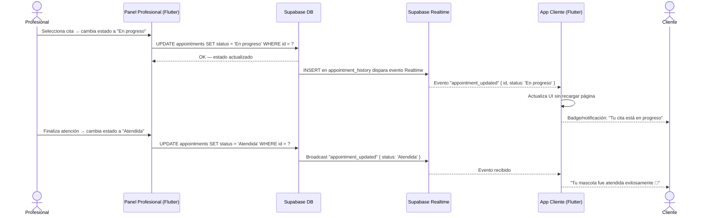
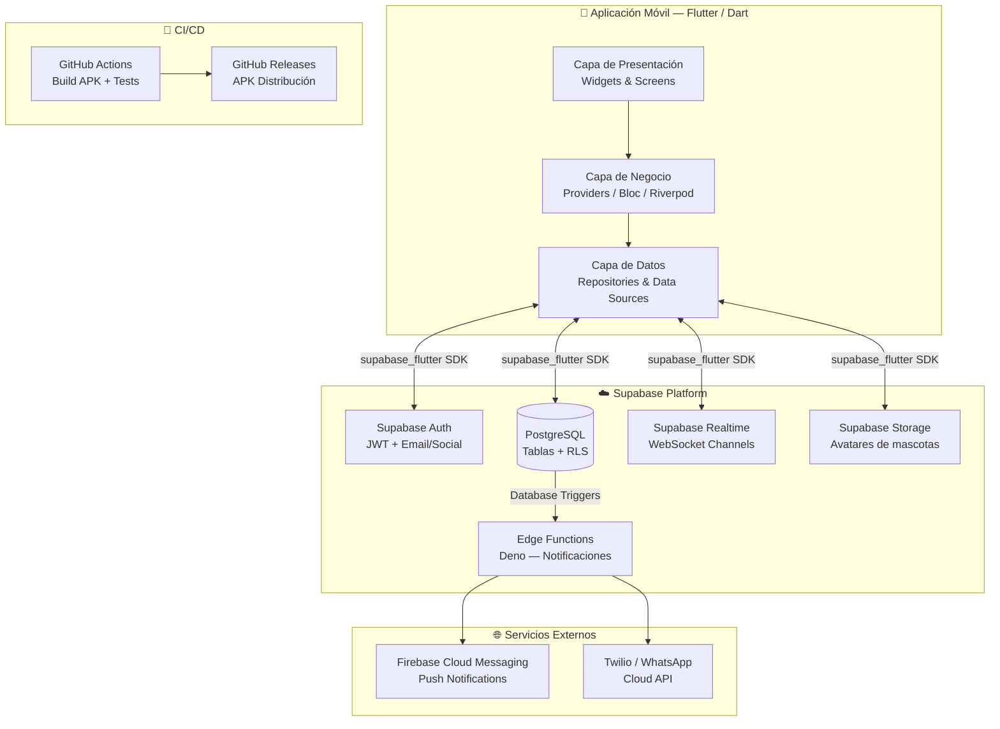

# 🐾 PetAppointment
## Sistema de Reserva de Citas Veterinarias y Peluquería Canina/Felina

---

<div align="center">


**Versión:** 1.0  
**Fecha:** Marzo 2026  
**Estado:** En desarrollo  

| Campo | Detalle |
|---|---|
| **Proyecto** | PetAppointment — Sistema de Citas Veterinarias |
| **Tipo** | Proyecto Universitario de Desarrollo Móvil |
| **Repositorio** | [github.com/tu-usuario/pet-appointment](https://github.com/tu-usuario/pet-appointment) |
| **Gestión de tareas** | Tablero Kanban en Jira |
| **Versión del documento** | 1.0 |
| **Fecha de creación** | Marzo 2026 |

### Autores

| Nombre | Código | Rol |
|---|---|---|
| [Nombre Estudiante 1] | [Código] | Desarrollador Flutter / Líder Técnico |
| [Nombre Estudiante 2] | [Código] | Desarrollador Flutter / Diseño UI/UX |
| [Nombre Estudiante 3] | [Código] | Integración Supabase / Base de Datos |

**Universidad:** [Nombre de la Universidad]  
**Facultad:** [Nombre de la Facultad]  
**Programa:** Ingeniería de Sistemas / Ingeniería de Software  
**Asignatura:** [Nombre de la Asignatura]  
**Docente:** [Nombre del Docente]  

</div>

---

## Tabla de Contenidos

1. [Visión General, Contexto y Objetivos](#1-visión-general-contexto-y-objetivos)
2. [Alcance Funcional Inicial](#2-alcance-funcional-inicial)
3. [Roles del Sistema](#3-roles-del-sistema)
4. [Diagramas](#4-diagramas)
5. [Épicas, Historias de Usuario y Tareas Técnicas](#5-épicas-historias-de-usuario-y-tareas-técnicas)
6. [Stack Tecnológico Detallado](#6-stack-tecnológico-detallado)
7. [Arquitectura Técnica](#7-arquitectura-técnica)
8. [Automatización con Supabase](#8-automatización-con-supabase)
9. [Puesta en Marcha y Workflow Recomendado](#9-puesta-en-marcha-y-workflow-recomendado)
10. [Manual de Usuario](#10-manual-de-usuario)
11. [Plan de Pruebas](#11-plan-de-pruebas)
12. [Riesgos y Mitigaciones](#12-riesgos-y-mitigaciones)
13. [Requisitos No Funcionales](#13-requisitos-no-funcionales)
14. [Roadmap y Futuras Mejoras](#14-roadmap-y-futuras-mejoras)

---

## 1. Visión General, Contexto y Objetivos

### 1.1 Contexto

El sector veterinario en América Latina ha experimentado un crecimiento sostenido debido al aumento en la tenencia responsable de mascotas. Sin embargo, la gestión de citas en clínicas veterinarias y peluquerías caninas/felinas continúa realizándose mayoritariamente de forma manual — mediante llamadas telefónicas, cuadernos físicos o grupos de mensajería informal — lo que genera conflictos de horarios, falta de trazabilidad y una experiencia deficiente tanto para el cliente como para el prestador del servicio.

**PetAppointment** surge como respuesta a esta problemática: una aplicación móvil multiplataforma desarrollada en Flutter y Dart, conectada directamente a Supabase como plataforma de backend, que permite gestionar de forma integral el ciclo de vida de las citas veterinarias y de peluquería para mascotas.

### 1.2 Objetivo General

Desarrollar una aplicación móvil funcional (APK para Android) que permita a los dueños de mascotas reservar, modificar y cancelar citas en clínicas veterinarias y peluquerías caninas/felinas, al tiempo que provee a los prestadores del servicio un panel de gestión con calendario visual, actualización de estados en tiempo real y notificaciones automáticas, aprovechando la infraestructura serverless de Supabase (Auth, Database, Realtime y Edge Functions).

### 1.3 Objetivos Específicos

1. Implementar un módulo de autenticación seguro mediante Supabase Auth que soporte registro e inicio de sesión para tres roles diferenciados: Cliente/Dueño de Mascota, Veterinario/Peluquero y Administrador.
2. Desarrollar un calendario visual interactivo en Flutter que permita visualizar la disponibilidad de horarios y evitar colisiones mediante sincronización en tiempo real utilizando Supabase Realtime.
3. Construir el modelo de datos relacional en PostgreSQL (Supabase) con tablas normalizadas para usuarios, mascotas, servicios, citas y estados, aplicando políticas de Row Level Security (RLS) para garantizar el acceso diferenciado por rol.
4. Integrar un sistema de notificaciones que incluya alertas push locales en el dispositivo y recordatorios automáticos mediante Supabase Edge Functions, con la posibilidad de extensión hacia notificaciones por WhatsApp a través de la API de Twilio o WhatsApp Business Cloud API.
5. Configurar un pipeline de integración y entrega continua (CI/CD) con GitHub Actions que automatice la compilación, las pruebas y la generación del APK instalable publicado como GitHub Release.
6. Implementar un flujo completo de gestión de estados de cita ("En espera", "Confirmada", "En progreso", "Atendida", "Cancelada") con actualización en tiempo real visible desde todos los roles del sistema.
7. Documentar el proyecto de forma completa para facilitar su comprensión, mantenimiento y extensión futura por parte del equipo de desarrollo y de evaluadores académicos.

---

## 2. Alcance Funcional Inicial

### 2.1 Incluido en la Versión 1.0

| # | Módulo | Funcionalidad incluida |
|---|---|---|
| 1 | Autenticación | Registro, inicio de sesión y cierre de sesión con Supabase Auth |
| 2 | Perfil | Gestión de datos del usuario y de sus mascotas (CRUD básico) |
| 3 | Catálogo de servicios | Listado de servicios disponibles (consulta veterinaria, baño, peluquería) |
| 4 | Reserva de citas | Selección de fecha, hora, mascota y servicio; confirmación de cita |
| 5 | Calendario visual | Vista de calendario con disponibilidad en tiempo real |
| 6 | Gestión de citas (cliente) | Visualizar, reprogramar y cancelar citas propias |
| 7 | Panel veterinario | Vista de agenda diaria/semanal; actualización de estado de citas |
| 8 | Panel administrador | Gestión de usuarios, servicios y horarios disponibles |
| 9 | Estados de cita | Flujo completo: En espera → Confirmada → En progreso → Atendida / Cancelada |
| 10 | Notificaciones | Notificaciones locales en dispositivo (recordatorios y cambios de estado) |
| 11 | Tiempo real | Sincronización de disponibilidad y estados vía Supabase Realtime |
| 12 | Seguridad | Row Level Security (RLS) en todas las tablas sensibles |
| 13 | APK | Generación de APK Android firmado mediante GitHub Actions |

### 2.2 Fuera del Alcance de la Versión 1.0

| # | Funcionalidad excluida | Razón |
|---|---|---|
| 1 | Pagos en línea (PSE, tarjeta, PayPal) | Complejidad regulatoria y técnica; roadmap v2.0 |
| 2 | Chat en tiempo real entre cliente y veterinario | Fuera del alcance académico de v1.0 |
| 3 | Historia clínica digital completa | Módulo especializado; roadmap v2.0 |
| 4 | Notificaciones por WhatsApp (producción) | Requiere cuenta verificada de negocio; incluido como prototipo |
| 5 | Soporte multiidioma (i18n) | No requerido para el contexto local del proyecto |
| 6 | Portal web administrativo | Solo aplicación móvil en v1.0 |
| 7 | Integración con wearables / IoT | Fuera del alcance del proyecto |
| 8 | Sistema de reseñas y calificaciones | Roadmap v2.0 |
| 9 | Módulo de inventario y farmacia | Fuera del alcance académico |
| 10 | App iOS en producción (App Store) | Se intentará soporte iOS; prioridad es Android APK |

---

## 3. Roles del Sistema

### 3.1 Descripción de Roles

| Rol | Identificador interno | Descripción |
|---|---|---|
| **Cliente / Dueño de Mascota** | `client` | Usuario final que registra sus mascotas y agenda citas. Puede visualizar su historial de citas y recibir notificaciones. |
| **Veterinario / Peluquero** | `professional` | Profesional que presta el servicio. Gestiona su agenda, confirma o cancela citas y actualiza el estado de atención. |
| **Administrador** | `admin` | Gestiona la configuración global del sistema: usuarios, servicios ofrecidos, horarios habilitados y reportes básicos. |

### 3.2 Permisos por Rol

| Acción | Cliente | Profesional | Administrador |
|---|:---:|:---:|:---:|
| Registrarse / Iniciar sesión | ✅ | ✅ | ✅ |
| Registrar mascotas | ✅ | ❌ | ✅ |
| Ver servicios disponibles | ✅ | ✅ | ✅ |
| Crear cita | ✅ | ❌ | ✅ |
| Cancelar cita propia | ✅ | ❌ | ✅ |
| Ver agenda de citas | Solo propias | Todas asignadas | Todas |
| Actualizar estado de cita | ❌ | ✅ | ✅ |
| Crear/editar servicios | ❌ | ❌ | ✅ |
| Gestionar horarios | ❌ | ❌ | ✅ |
| Ver panel de administración | ❌ | ❌ | ✅ |
| Gestionar usuarios | ❌ | ❌ | ✅ |

---

## 4. Diagramas

> **Nota:** Todos los diagramas están escritos en sintaxis Mermaid y se renderizan automáticamente en GitHub, GitLab y herramientas compatibles.

### 4.1 Diagrama de Casos de Uso



### 4.2 Diagrama Entidad-Relación (ERD)



### 4.3 Diagrama de Secuencia — Reservar una Cita



### 4.4 Diagrama de Secuencia — Cancelar una Cita



### 4.5 Diagrama de Secuencia — Actualización de Estado en Tiempo Real



### 4.6 Diagrama de Arquitectura Técnica



### 4.7 Flujo General del Sistema

```mermaid
flowchart TD
    A([Inicio]) --> B{¿Tiene cuenta?}
    B -->|No| C[Registro con email y contraseña]
    B -->|Sí| D[Inicio de sesión]
    C --> D
    D --> E{¿Qué rol tienes?}

    E -->|Cliente| F[Dashboard Cliente]
    E -->|Profesional| G[Dashboard Profesional]
    E -->|Admin| H[Panel Administración]

    F --> F1[Ver mis mascotas]
    F --> F2[Reservar nueva cita]
    F --> F3[Ver mis citas]

    F2 --> I[Seleccionar servicio]
    I --> J[Ver calendario disponible]
    J --> K[Elegir horario libre]
    K --> L[Confirmar cita]
    L --> M[Cita creada — Estado: En espera]
    M --> N[Notificación al profesional]

    G --> G1[Ver agenda del día]
    G --> G2[Confirmar cita]
    G --> G3[Actualizar estado]
    G3 --> G3A[En progreso → Atendida]

    G2 --> O[Notificación al cliente]
    G3 --> O

    H --> H1[Gestionar usuarios]
    H --> H2[Gestionar servicios]
    H --> H3[Gestionar horarios]
    H --> H4[Ver reportes]
```



---

## 5. Épicas, Historias de Usuario y Tareas Técnicas

### 5.1 Épicas del Proyecto

| ID | Épica | Descripción | Prioridad |
|---|---|---|---|
| EP-01 | Autenticación y Gestión de Usuarios | Registro, inicio de sesión, recuperación de contraseña y gestión de perfiles por rol | Alta |
| EP-02 | Gestión de Mascotas | CRUD completo de mascotas asociadas a un cliente | Alta |
| EP-03 | Reserva y Gestión de Citas | Flujo completo de creación, modificación y cancelación de citas con calendario visual | Alta |
| EP-04 | Panel del Profesional | Agenda visual, actualización de estados y gestión de disponibilidad | Alta |
| EP-05 | Notificaciones y Tiempo Real | Sincronización en tiempo real, notificaciones locales y recordatorios automáticos | Media |
| EP-06 | Panel de Administración | Gestión de catálogos (servicios, horarios, usuarios) y reportes | Media |
| EP-07 | CI/CD y Calidad | Pipeline de GitHub Actions, pruebas automatizadas y generación de APK | Media |

### 5.2 Historias de Usuario

#### Épica EP-01: Autenticación y Gestión de Usuarios

| ID | Historia de Usuario | Criterios de Aceptación | Story Points |
|---|---|---|---|
| US-01 | Como **usuario nuevo**, quiero **registrarme con mi correo y contraseña** para **acceder a la aplicación y gestionar mis citas**. | Formulario con validación, confirmación por email, asignación de rol | 3 |
| US-02 | Como **usuario registrado**, quiero **iniciar sesión con mi correo y contraseña** para **acceder a mi cuenta de forma segura**. | Autenticación vía Supabase Auth, token JWT, manejo de errores | 2 |
| US-03 | Como **usuario**, quiero **recuperar mi contraseña mediante email** para **no perder acceso a mi cuenta si la olvido**. | Email de recuperación enviado, enlace funcional, nueva contraseña actualizada | 2 |
| US-04 | Como **usuario**, quiero **ver y editar mi perfil** (nombre, teléfono, foto) para **mantener mis datos actualizados**. | Formulario editable, actualización en Supabase, confirmación visual | 3 |
| US-05 | Como **administrador**, quiero **ver el listado de usuarios registrados** para **gestionar accesos y roles**. | Tabla paginada con filtro por rol, opción de cambiar rol o deshabilitar cuenta | 5 |

#### Épica EP-02: Gestión de Mascotas

| ID | Historia de Usuario | Criterios de Aceptación | Story Points |
|---|---|---|---|
| US-06 | Como **cliente**, quiero **registrar mis mascotas** (nombre, especie, raza, fecha de nacimiento) para **asociarlas a mis citas**. | Formulario con validación, foto opcional, guardado en Supabase | 3 |
| US-07 | Como **cliente**, quiero **ver el listado de mis mascotas registradas** para **seleccionar la correcta al agendar una cita**. | Lista con foto y datos básicos, indicador de última cita | 2 |
| US-08 | Como **cliente**, quiero **editar la información de mi mascota** para **mantener sus datos actualizados**. | Formulario prellenado, actualización en DB, confirmación | 2 |
| US-09 | Como **cliente**, quiero **eliminar una mascota de mi perfil** para **mantener solo los registros vigentes**. | Confirmación antes de eliminar, verificación de citas activas asociadas | 2 |

#### Épica EP-03: Reserva y Gestión de Citas

| ID | Historia de Usuario | Criterios de Aceptación | Story Points |
|---|---|---|---|
| US-10 | Como **cliente**, quiero **ver un calendario con los horarios disponibles** para **elegir el que mejor se adapte a mi agenda**. | Calendario visual con slots libres/ocupados, sincronizado en tiempo real | 8 |
| US-11 | Como **cliente**, quiero **reservar una cita** seleccionando servicio, profesional, mascota, fecha y hora para **garantizar mi atención**. | Flujo de reserva en pasos, validación de disponibilidad, cita creada con estado "En espera" | 8 |
| US-12 | Como **cliente**, quiero **recibir una confirmación inmediata** tras reservar una cita para **tener certeza de que fue registrada**. | Pantalla de éxito con resumen de la cita, notificación local | 3 |
| US-13 | Como **cliente**, quiero **ver el historial de todas mis citas** (pasadas y futuras) para **llevar un control de la salud de mis mascotas**. | Lista ordenada por fecha, indicador de estado, detalle al pulsar | 3 |
| US-14 | Como **cliente**, quiero **cancelar una cita con antelación** para **liberar el horario y notificar al profesional**. | Confirmación de cancelación, estado actualizado, slot liberado, notificación enviada | 5 |
| US-15 | Como **cliente**, quiero **reprogramar una cita** para **adaptarla a cambios en mi agenda sin perder el servicio**. | Selección de nuevo slot, cancelación del anterior, nueva cita creada | 5 |

#### Épica EP-04: Panel del Profesional

| ID | Historia de Usuario | Criterios de Aceptación | Story Points |
|---|---|---|---|
| US-16 | Como **profesional**, quiero **ver mi agenda diaria y semanal** para **planificar mi jornada de trabajo**. | Vista de calendario con citas agrupadas, datos del cliente y mascota visibles | 5 |
| US-17 | Como **profesional**, quiero **confirmar una cita pendiente** para **notificar al cliente que su reserva fue aceptada**. | Botón de confirmación, estado cambia a "Confirmada", notificación automática al cliente | 3 |
| US-18 | Como **profesional**, quiero **actualizar el estado de una cita** (en progreso, atendida) para **reflejar el avance en tiempo real**. | Selector de estado con transiciones válidas, actualización instantánea vía Realtime | 5 |
| US-19 | Como **profesional**, quiero **configurar mis horarios de disponibilidad** para **que solo se puedan agendar citas en mis horas laborales**. | Selector de días/horas, persistencia en available_slots, reflejo en el calendario del cliente | 8 |

#### Épica EP-05: Notificaciones y Tiempo Real

| ID | Historia de Usuario | Criterios de Aceptación | Story Points |
|---|---|---|---|
| US-20 | Como **cliente**, quiero **recibir una notificación** cuando el estado de mi cita cambie para **estar siempre informado**. | Notificación local en dispositivo al detectar cambio de estado vía Realtime | 5 |
| US-21 | Como **cliente**, quiero **recibir un recordatorio 24 horas antes** de mi cita para **no olvidarla**. | Notificación programada vía Supabase Edge Function o flutter_local_notifications | 5 |
| US-22 | Como **profesional**, quiero **ser notificado al instante** cuando se registre una nueva cita para **preparar mi agenda con anticipación**. | Notificación push en tiempo real vía Supabase Realtime | 3 |

#### Épica EP-06: Panel de Administración

| ID | Historia de Usuario | Criterios de Aceptación | Story Points |
|---|---|---|---|
| US-23 | Como **administrador**, quiero **crear, editar y desactivar servicios** para **mantener actualizado el catálogo de la clínica**. | CRUD completo de servicios, activación/desactivación sin eliminar | 5 |
| US-24 | Como **administrador**, quiero **ver un reporte básico de citas** por período y estado para **evaluar la demanda del servicio**. | Listado filtrable por fecha y estado, contadores por categoría | 8 |

### 5.3 Tareas Técnicas e Issues

La jerarquía recomendada en Jira para este proyecto es:

**Épica -> Historia de Usuario (HU) -> Subtareas técnicas (TASK)**.

Cuando una tarea no está ligada directamente a una HU funcional (por ejemplo CI/CD, configuración base o documentación técnica), se crea una **Historia Técnica (HT)** bajo la épica correspondiente.

Este documento conserva una vista resumida de las tareas. Para el desglose completo por sprint, semanas, responsables y subtareas ampliadas, consulta [05-epicas-historias-y-tareas-tecnicas-plan-sprints.md](secciones/05-epicas-historias-y-tareas-tecnicas-plan-sprints.md).

| ID | Tarea Técnica | HU/HT asociada | Épica | Estimación |
|---|---|---|---|---|
| TASK-01 | Configurar proyecto Flutter con estructura de carpetas por features | HT-01 (Base del proyecto) | EP-07 | 4h |
| TASK-02 | Configurar proyecto Supabase (Auth, DB, Realtime, Storage) | HT-02 (Infraestructura backend) | EP-01 | 3h |
| TASK-03 | Definir esquema de base de datos y ejecutar migrations | HT-03 (Modelo de datos) | EP-01 | 6h |
| TASK-04 | Implementar RLS policies para todas las tablas | HT-04 (Seguridad de datos) | EP-01 | 6h |
| TASK-05 | Integrar paquete `supabase_flutter` y configurar cliente global | US-02 | EP-01 | 2h |
| TASK-06 | Implementar flujo de autenticación (registro, login, logout) | US-01 / US-02 / US-03 | EP-01 | 8h |
| TASK-07 | Implementar navegación por rol con Go Router | US-05 | EP-01 | 4h |
| TASK-08 | Desarrollar pantallas de gestión de mascotas (CRUD) | US-06 / US-07 / US-08 / US-09 | EP-02 | 10h |
| TASK-09 | Integrar `table_calendar` para vista de disponibilidad | US-10 | EP-03 | 8h |
| TASK-10 | Implementar lógica de reserva con validación de colisiones | US-11 | EP-03 | 10h |
| TASK-11 | Implementar suscripción Realtime para slots y citas | US-20 / US-22 | EP-05 | 8h |
| TASK-12 | Desarrollar panel del profesional con agenda interactiva | US-16 | EP-04 | 12h |
| TASK-13 | Implementar cambio de estado de citas con historial | US-18 | EP-04 | 6h |
| TASK-14 | Integrar `flutter_local_notifications` para recordatorios | US-21 | EP-05 | 6h |
| TASK-15 | Crear Edge Function para recordatorios automáticos (cron) | US-21 | EP-05 | 8h |
| TASK-16 | Prototipo de Edge Function para notificación por WhatsApp (Twilio) | HT-05 (Prototipo de notificación externa) | EP-05 | 6h |
| TASK-17 | Desarrollar panel de administración (servicios, horarios, usuarios) | US-23 / US-24 | EP-06 | 16h |
| TASK-18 | Configurar GitHub Actions para build de APK | HT-06 (Automatización de build) | EP-07 | 4h |
| TASK-19 | Configurar GitHub Actions para tests y lint | HT-07 (Calidad automatizada) | EP-07 | 3h |
| TASK-20 | Escribir pruebas unitarias y de widget (cobertura mínima 60%) | HT-07 (Calidad automatizada) | EP-07 | 12h |
| TASK-21 | Generar keystore y firmar APK para release | HT-08 (Release APK) | EP-07 | 2h |
| TASK-22 | Documentar API de Supabase y funciones edge | HT-09 (Documentación técnica) | EP-07 | 4h |

---

## 6. Stack Tecnológico Detallado

| Categoría | Tecnología | Versión Recomendada (2025-2026) | Propósito |
|---|---|---|---|
| **Lenguaje** | Dart | 3.6.x | Lenguaje principal de Flutter |
| **Framework móvil** | Flutter | 3.27.x (stable) | Desarrollo multiplataforma iOS/Android |
| **Backend/DB** | Supabase | Última versión cloud | BaaS: Auth, DB, Realtime, Storage, Edge Functions |
| **Base de datos** | PostgreSQL | 15.x (via Supabase) | Motor relacional principal |
| **Autenticación** | Supabase Auth | — | JWT, email/password, OAuth |
| **Tiempo real** | Supabase Realtime | — | WebSocket channels para sincronización |
| **Almacenamiento** | Supabase Storage | — | Fotos de mascotas y avatares |
| **Edge Functions** | Deno (via Supabase) | 1.x | Lógica serverless para notificaciones y triggers |
| **SDK Flutter** | supabase_flutter | ^2.5.x | Cliente oficial Supabase para Flutter |
| **Gestión de estado** | Riverpod | ^2.5.x | Gestión reactiva de estado |
| **Navegación** | Go Router | ^14.x | Navegación declarativa por rol |
| **Calendario** | table_calendar | ^3.1.x | Widget de calendario interactivo |
| **Notificaciones locales** | flutter_local_notifications | ^17.x | Recordatorios y alertas en dispositivo |
| **Notificaciones push** | firebase_messaging | ^15.x | Push notifications en background |
| **Inyección de dependencias** | get_it | ^7.7.x | Service locator para DI |
| **HTTP adicional** | dio | ^5.7.x | Peticiones HTTP avanzadas (para Twilio, etc.) |
| **Formularios** | reactive_forms | ^17.x | Gestión reactiva de formularios |
| **Linting** | flutter_lints | ^4.x | Reglas de estilo de código |
| **Testing** | flutter_test / mocktail | SDK incluido / ^1.x | Pruebas unitarias y de widget |
| **CI/CD** | GitHub Actions | — | Pipeline automatizado |
| **Gestión de proyecto** | Jira (tablero Kanban) | Cloud | Seguimiento de épicas, historias e issues |
| **Notificaciones WhatsApp** | Twilio WhatsApp API | v1 REST | Notificaciones por WhatsApp (prototipo) |
| **Versionamiento** | Git + GitHub | — | Control de versiones y colaboración |
| **IDE recomendado** | VS Code + Android Studio | Última versión | Desarrollo y debug Flutter |

---

## 7. Arquitectura Técnica

### 7.1 Estructura del Proyecto Flutter

```
pet_appointment/
├── lib/
│   ├── main.dart                    # Punto de entrada de la aplicación
│   ├── app.dart                     # Widget raíz, configuración de tema y router
│   │
│   ├── core/                        # Código transversal reutilizable
│   │   ├── constants/
│   │   │   ├── app_colors.dart
│   │   │   ├── app_strings.dart
│   │   │   └── supabase_constants.dart
│   │   ├── errors/
│   │   │   ├── failures.dart
│   │   │   └── exceptions.dart
│   │   ├── network/
│   │   │   └── supabase_client.dart  # Singleton del cliente Supabase
│   │   ├── router/
│   │   │   └── app_router.dart       # Configuración Go Router + guards por rol
│   │   ├── theme/
│   │   │   └── app_theme.dart
│   │   └── utils/
│   │       ├── date_helpers.dart
│   │       └── validators.dart
│   │
│   ├── features/                    # Módulos por funcionalidad (Feature-First)
│   │   ├── auth/
│   │   │   ├── data/
│   │   │   │   ├── datasources/
│   │   │   │   │   └── auth_supabase_datasource.dart
│   │   │   │   └── repositories/
│   │   │   │       └── auth_repository_impl.dart
│   │   │   ├── domain/
│   │   │   │   ├── entities/
│   │   │   │   │   └── app_user.dart
│   │   │   │   ├── repositories/
│   │   │   │   │   └── auth_repository.dart
│   │   │   │   └── usecases/
│   │   │   │       ├── sign_in_usecase.dart
│   │   │   │       ├── sign_up_usecase.dart
│   │   │   │       └── sign_out_usecase.dart
│   │   │   └── presentation/
│   │   │       ├── providers/
│   │   │       │   └── auth_provider.dart
│   │   │       └── screens/
│   │   │           ├── login_screen.dart
│   │   │           ├── register_screen.dart
│   │   │           └── forgot_password_screen.dart
│   │   │
│   │   ├── pets/                    # Gestión de mascotas
│   │   │   └── [misma estructura data/domain/presentation]
│   │   │
│   │   ├── appointments/            # Reserva y gestión de citas
│   │   │   └── [misma estructura data/domain/presentation]
│   │   │
│   │   ├── calendar/                # Calendario y disponibilidad
│   │   │   └── [misma estructura data/domain/presentation]
│   │   │
│   │   ├── professional/            # Panel del profesional
│   │   │   └── [misma estructura data/domain/presentation]
│   │   │
│   │   ├── admin/                   # Panel de administración
│   │   │   └── [misma estructura data/domain/presentation]
│   │   │
│   │   └── notifications/           # Notificaciones locales y push
│   │       └── [misma estructura data/domain/presentation]
│   │
│   └── shared/                      # Widgets y componentes compartidos
│       ├── widgets/
│       │   ├── custom_button.dart
│       │   ├── custom_text_field.dart
│       │   ├── appointment_card.dart
│       │   ├── pet_avatar.dart
│       │   └── loading_overlay.dart
│       └── extensions/
│           └── context_extensions.dart
│
├── test/                            # Pruebas automatizadas
│   ├── unit/
│   ├── widget/
│   └── integration/
│
├── supabase/                        # Archivos de configuración Supabase
│   ├── migrations/                  # Scripts SQL de migración
│   │   ├── 001_initial_schema.sql
│   │   ├── 002_rls_policies.sql
│   │   └── 003_seed_data.sql
│   └── functions/                   # Edge Functions (Deno)
│       ├── send-appointment-reminder/
│       │   └── index.ts
│       └── send-whatsapp-notification/
│           └── index.ts
│
├── .github/
│   └── workflows/
│       ├── ci.yml                   # Tests y lint en cada PR
│       └── release-apk.yml          # Build y release del APK
│
├── docs/                            # Documentación adicional
│   ├── architecture.md
│   ├── api-reference.md
│   └── screenshots/
│
├── pubspec.yaml
├── pubspec.lock
├── analysis_options.yaml
└── README.md
```

### 7.2 Estructura del Repositorio GitHub

```
pet-appointment/                     # Repositorio raíz
├── .github/
│   ├── workflows/
│   │   ├── ci.yml
│   │   └── release-apk.yml
│   ├── ISSUE_TEMPLATE/
│   │   ├── bug_report.md
│   │   └── feature_request.md
│   └── pull_request_template.md
│
├── android/                         # Configuración nativa Android (auto-generado por Flutter)
├── ios/                             # Configuración nativa iOS
├── lib/                             # Código fuente Flutter (ver sección 7.1)
├── test/                            # Pruebas
├── supabase/                        # Migraciones y Edge Functions
├── docs/                            # Documentación del proyecto
│   ├── PetAppointment_Documentacion_Tecnica.md
│   ├── api-reference.md
│   └── screenshots/
│
├── pubspec.yaml
├── analysis_options.yaml
├── .gitignore
├── .env.example                     # Variables de entorno de ejemplo (sin datos reales)
└── README.md
```

### 7.3 Conexión Flutter ↔ Supabase

#### Configuración inicial del cliente

```dart
// lib/main.dart
import 'package:flutter/material.dart';
import 'package:supabase_flutter/supabase_flutter.dart';
import 'app.dart';

Future<void> main() async {
  WidgetsFlutterBinding.ensureInitialized();

  await Supabase.initialize(
    url: const String.fromEnvironment('SUPABASE_URL'),
    anonKey: const String.fromEnvironment('SUPABASE_ANON_KEY'),
  );

  runApp(const PetAppointmentApp());
}

// Acceso global al cliente (desde cualquier parte de la app)
final supabase = Supabase.instance.client;
```

#### Consulta de citas del cliente autenticado

```dart
// lib/features/appointments/data/datasources/appointment_supabase_datasource.dart
import 'package:supabase_flutter/supabase_flutter.dart';
import '../../domain/entities/appointment.dart';

class AppointmentSupabaseDataSource {
  final SupabaseClient _client;

  AppointmentSupabaseDataSource(this._client);

  /// Obtiene todas las citas del usuario autenticado, con joins a pets y services
  Future<List<Map<String, dynamic>>> getClientAppointments() async {
    final userId = _client.auth.currentUser?.id;
    if (userId == null) throw Exception('Usuario no autenticado');

    final response = await _client
        .from('appointments')
        .select('''
          id,
          status,
          notes,
          created_at,
          pets (id, name, species),
          services (id, name, duration_minutes, price),
          available_slots (slot_start, slot_end),
          professionals (
            users (full_name)
          )
        ''')
        .eq('client_id', userId)
        .order('created_at', ascending: false);

    return List<Map<String, dynamic>>.from(response);
  }

  /// Crea una nueva cita y marca el slot como ocupado (transacción lógica)
  Future<Map<String, dynamic>> createAppointment({
    required String petId,
    required String professionalId,
    required String serviceId,
    required String slotId,
    String? notes,
  }) async {
    final userId = _client.auth.currentUser?.id;
    if (userId == null) throw Exception('Usuario no autenticado');

    // Verificar disponibilidad antes de insertar (optimistic locking simple)
    final slotCheck = await _client
        .from('available_slots')
        .select('is_available')
        .eq('id', slotId)
        .single();

    if (slotCheck['is_available'] != true) {
      throw Exception('El horario seleccionado ya no está disponible');
    }

    // Crear la cita
    final appointment = await _client.from('appointments').insert({
      'client_id': userId,
      'pet_id': petId,
      'professional_id': professionalId,
      'service_id': serviceId,
      'slot_id': slotId,
      'status': 'En espera',
      'notes': notes,
    }).select().single();

    // Marcar el slot como ocupado
    await _client
        .from('available_slots')
        .update({'is_available': false})
        .eq('id', slotId);

    return appointment;
  }

  /// Cancela una cita y libera el slot
  Future<void> cancelAppointment(String appointmentId, String slotId) async {
    await _client
        .from('appointments')
        .update({'status': 'Cancelada'})
        .eq('id', appointmentId);

    await _client
        .from('available_slots')
        .update({'is_available': true})
        .eq('id', slotId);
  }
}
```

#### Suscripción Realtime a cambios de citas

```dart
// lib/features/appointments/presentation/providers/appointments_realtime_provider.dart
import 'package:flutter_riverpod/flutter_riverpod.dart';
import 'package:supabase_flutter/supabase_flutter.dart';

final appointmentsRealtimeProvider = StreamProvider.autoDispose<List<Map<String, dynamic>>>((ref) {
  final supabase = Supabase.instance.client;
  final userId = supabase.auth.currentUser?.id;

  // Canal Realtime para las citas del usuario actual
  final stream = supabase
      .from('appointments')
      .stream(primaryKey: ['id'])
      .eq('client_id', userId!)
      .order('created_at', ascending: false);

  return stream;
});

// Uso en un widget
class AppointmentListScreen extends ConsumerWidget {
  @override
  Widget build(BuildContext context, WidgetRef ref) {
    final appointmentsAsync = ref.watch(appointmentsRealtimeProvider);

    return appointmentsAsync.when(
      data: (appointments) => ListView.builder(
        itemCount: appointments.length,
        itemBuilder: (context, index) => AppointmentCard(
          appointment: appointments[index],
        ),
      ),
      loading: () => const CircularProgressIndicator(),
      error: (error, stack) => Text('Error: $error'),
    );
  }
}
```

---

## 8. Automatización con Supabase

### 8.1 Sincronización en Tiempo Real de Horarios

La sincronización en tiempo real se implementa mediante **Supabase Realtime** usando canales de Postgres Changes. Cuando un slot cambia de disponibilidad (alguien agenda o cancela), todos los clientes conectados reciben la actualización instantáneamente.

```dart
// lib/features/calendar/data/datasources/calendar_realtime_datasource.dart
import 'package:supabase_flutter/supabase_flutter.dart';

class CalendarRealtimeDatasource {
  final SupabaseClient _client;
  RealtimeChannel? _slotsChannel;

  CalendarRealtimeDatasource(this._client);

  /// Suscripción a cambios en available_slots para un profesional y fecha específicos
  Stream<List<Map<String, dynamic>>> watchAvailableSlots({
    required String professionalId,
    required DateTime date,
  }) {
    return _client
        .from('available_slots')
        .stream(primaryKey: ['id'])
        .eq('professional_id', professionalId)
        .order('slot_start');
  }

  /// Suscripción broadcast para notificaciones de nueva cita al profesional
  void subscribeToNewAppointments({
    required String professionalId,
    required Function(Map<String, dynamic>) onNewAppointment,
  }) {
    _slotsChannel = _client
        .channel('appointments:professional:$professionalId')
        .onPostgresChanges(
          event: PostgresChangeEvent.insert,
          schema: 'public',
          table: 'appointments',
          filter: PostgresChangeFilter(
            type: PostgresChangeFilterType.eq,
            column: 'professional_id',
            value: professionalId,
          ),
          callback: (payload) {
            onNewAppointment(payload.newRecord);
          },
        )
        .subscribe();
  }

  void dispose() {
    _slotsChannel?.unsubscribe();
  }
}
```

### 8.2 Recordatorios Automáticos con Edge Functions

La Edge Function de recordatorio se ejecuta mediante un **cron job programado** en Supabase (pg_cron) que dispara la función cada hora para revisar citas próximas.

```typescript
// supabase/functions/send-appointment-reminder/index.ts
import { serve } from "https://deno.land/std@0.168.0/http/server.ts";
import { createClient } from "https://esm.sh/@supabase/supabase-js@2";

const supabaseAdmin = createClient(
  Deno.env.get("SUPABASE_URL")!,
  Deno.env.get("SUPABASE_SERVICE_ROLE_KEY")!
);

serve(async (_req) => {
  // Buscar citas que ocurren en las próximas 24 horas
  const tomorrow = new Date();
  tomorrow.setHours(tomorrow.getHours() + 24);

  const today = new Date();

  const { data: upcomingAppointments, error } = await supabaseAdmin
    .from("appointments")
    .select(`
      id,
      status,
      client_id,
      pets (name),
      services (name),
      available_slots (slot_start),
      users!client_id (full_name, phone)
    `)
    .eq("status", "Confirmada")
    .gte("available_slots.slot_start", today.toISOString())
    .lte("available_slots.slot_start", tomorrow.toISOString());

  if (error) {
    return new Response(JSON.stringify({ error: error.message }), { status: 500 });
  }

  // Crear notificación en DB para cada cita próxima
  for (const appointment of upcomingAppointments ?? []) {
    await supabaseAdmin.from("notifications").insert({
      user_id: appointment.client_id,
      appointment_id: appointment.id,
      type: "reminder_24h",
      message: `Recordatorio: Mañana tienes cita para ${appointment.pets?.name} — ${appointment.services?.name}`,
      is_read: false,
    });
  }

  return new Response(
    JSON.stringify({ processed: upcomingAppointments?.length ?? 0 }),
    { headers: { "Content-Type": "application/json" } }
  );
});
```

**Configuración del cron job en Supabase (SQL):**

```sql
-- Ejecutar la Edge Function cada hora para revisar recordatorios
select cron.schedule(
  'appointment-reminders',
  '0 * * * *',  -- cada hora
  $$
  select
    net.http_post(
      url := current_setting('app.settings.edge_function_url') || '/send-appointment-reminder',
      headers := jsonb_build_object(
        'Content-Type', 'application/json',
        'Authorization', 'Bearer ' || current_setting('app.settings.service_role_key')
      ),
      body := '{}'::jsonb
    )
  $$
);
```

### 8.3 Notificaciones por WhatsApp (Twilio)

Este módulo se implementa como **prototipo funcional**. Requiere una cuenta de Twilio con el sandbox o número de WhatsApp Business verificado.

**Paso 1:** Crear la Edge Function para WhatsApp

```typescript
// supabase/functions/send-whatsapp-notification/index.ts
import { serve } from "https://deno.land/std@0.168.0/http/server.ts";

const TWILIO_ACCOUNT_SID = Deno.env.get("TWILIO_ACCOUNT_SID")!;
const TWILIO_AUTH_TOKEN = Deno.env.get("TWILIO_AUTH_TOKEN")!;
const TWILIO_WHATSAPP_FROM = Deno.env.get("TWILIO_WHATSAPP_FROM")!; // "whatsapp:+14155238886"

serve(async (req) => {
  const { to_phone, message } = await req.json();

  // Formatear número para WhatsApp (E.164)
  const toWhatsApp = `whatsapp:+57${to_phone.replace(/\D/g, "")}`;

  const twilioUrl = `https://api.twilio.com/2010-04-01/Accounts/${TWILIO_ACCOUNT_SID}/Messages.json`;

  const body = new URLSearchParams({
    From: TWILIO_WHATSAPP_FROM,
    To: toWhatsApp,
    Body: message,
  });

  const response = await fetch(twilioUrl, {
    method: "POST",
    headers: {
      Authorization: "Basic " + btoa(`${TWILIO_ACCOUNT_SID}:${TWILIO_AUTH_TOKEN}`),
      "Content-Type": "application/x-www-form-urlencoded",
    },
    body: body.toString(),
  });

  const result = await response.json();

  return new Response(JSON.stringify(result), {
    headers: { "Content-Type": "application/json" },
    status: response.status,
  });
});
```

**Paso 2:** Configurar Database Trigger en PostgreSQL

```sql
-- Función que se ejecuta al cambiar el estado de una cita
create or replace function notify_whatsapp_on_status_change()
returns trigger as $$
declare
  client_phone text;
  client_name text;
  pet_name text;
  service_name text;
  msg text;
begin
  -- Solo notificar en cambios relevantes de estado
  if NEW.status in ('Confirmada', 'Cancelada', 'Atendida') then

    -- Obtener datos del cliente y la mascota
    select u.phone, u.full_name, p.name, s.name
    into client_phone, client_name, pet_name, service_name
    from users u
    join pets p on p.id = NEW.pet_id
    join services s on s.id = NEW.service_id
    where u.id = NEW.client_id;

    -- Construir mensaje según estado
    msg := case NEW.status
      when 'Confirmada' then
        '✅ Hola ' || client_name || ', tu cita para ' || pet_name ||
        ' (' || service_name || ') ha sido CONFIRMADA. ¡Te esperamos! 🐾'
      when 'Cancelada' then
        '❌ Hola ' || client_name || ', lamentamos informarte que la cita de ' ||
        pet_name || ' ha sido CANCELADA. Contáctanos para reprogramar.'
      when 'Atendida' then
        '🎉 ¡Listo! ' || pet_name || ' fue atendido(a) exitosamente. ' ||
        'Gracias por confiar en nosotros. 🐾'
      else ''
    end;

    -- Invocar Edge Function via pg_net (extensión de Supabase)
    perform net.http_post(
      url := current_setting('app.settings.edge_function_url') || '/send-whatsapp-notification',
      headers := jsonb_build_object(
        'Content-Type', 'application/json',
        'Authorization', 'Bearer ' || current_setting('app.settings.service_role_key')
      ),
      body := jsonb_build_object(
        'to_phone', client_phone,
        'message', msg
      )
    );
  end if;

  return NEW;
end;
$$ language plpgsql security definer;

-- Registrar el trigger en la tabla appointments
create trigger on_appointment_status_change
  after update of status on appointments
  for each row
  execute function notify_whatsapp_on_status_change();
```

---

## 9. Puesta en Marcha y Workflow Recomendado

### 9.1 Prerrequisitos

1. Flutter SDK instalado y en PATH (`flutter doctor` sin errores).
2. Android Studio o VS Code con extensión Flutter.
3. Cuenta en [supabase.com](https://supabase.com) con proyecto creado.
4. Cuenta en GitHub con repositorio creado.
5. (Opcional) Cuenta en Twilio para notificaciones WhatsApp.

### 9.2 Configuración Inicial del Proyecto

```bash
# 1. Clonar el repositorio
git clone https://github.com/tu-usuario/pet-appointment.git
cd pet-appointment

# 2. Instalar dependencias
flutter pub get

# 3. Configurar variables de entorno
cp .env.example .env
# Editar .env con las credenciales de Supabase

# 4. Ejecutar migraciones en Supabase
# Ir a Supabase Dashboard > SQL Editor y ejecutar:
# supabase/migrations/001_initial_schema.sql
# supabase/migrations/002_rls_policies.sql
# supabase/migrations/003_seed_data.sql

# 5. Ejecutar la aplicación
flutter run

# 6. Generar APK de debug
flutter build apk --debug

# 7. Generar APK de release (requiere keystore configurado)
flutter build apk --release
```

### 9.3 CI/CD con GitHub Actions

#### Workflow de integración continua (tests y lint)

```yaml
# .github/workflows/ci.yml
name: CI — Tests y Lint

on:
  push:
    branches: [main, develop]
  pull_request:
    branches: [main, develop]

jobs:
  test-and-lint:
    name: Tests y Análisis Estático
    runs-on: ubuntu-latest

    steps:
      - name: Checkout código
        uses: actions/checkout@v4

      - name: Configurar Flutter
        uses: subosito/flutter-action@v2
        with:
          flutter-version: '3.27.0'
          channel: 'stable'

      - name: Instalar dependencias
        run: flutter pub get

      - name: Verificar formato de código
        run: dart format --output=none --set-exit-if-changed .

      - name: Análisis estático (flutter analyze)
        run: flutter analyze

      - name: Ejecutar pruebas unitarias y de widget
        run: flutter test --coverage

      - name: Subir reporte de cobertura
        uses: codecov/codecov-action@v4
        with:
          file: coverage/lcov.info
```

#### Workflow de release (build APK)

```yaml
# .github/workflows/release-apk.yml
name: Release — Build y Publicar APK

on:
  push:
    tags:
      - 'v*.*.*'  # Se activa con tags tipo v1.0.0

jobs:
  build-apk:
    name: Build APK Android
    runs-on: ubuntu-latest

    steps:
      - name: Checkout código
        uses: actions/checkout@v4

      - name: Configurar Java
        uses: actions/setup-java@v4
        with:
          distribution: 'temurin'
          java-version: '17'

      - name: Configurar Flutter
        uses: subosito/flutter-action@v2
        with:
          flutter-version: '3.27.0'
          channel: 'stable'

      - name: Instalar dependencias
        run: flutter pub get

      - name: Configurar keystore desde secrets
        run: |
          echo "${{ secrets.KEYSTORE_BASE64 }}" | base64 --decode > android/app/keystore.jks
          echo "storeFile=keystore.jks" >> android/key.properties
          echo "storePassword=${{ secrets.KEYSTORE_PASSWORD }}" >> android/key.properties
          echo "keyAlias=${{ secrets.KEY_ALIAS }}" >> android/key.properties
          echo "keyPassword=${{ secrets.KEY_PASSWORD }}" >> android/key.properties

      - name: Build APK Release
        run: flutter build apk --release
        env:
          SUPABASE_URL: ${{ secrets.SUPABASE_URL }}
          SUPABASE_ANON_KEY: ${{ secrets.SUPABASE_ANON_KEY }}

      - name: Publicar en GitHub Releases
        uses: softprops/action-gh-release@v2
        with:
          files: build/app/outputs/flutter-apk/app-release.apk
          name: PetAppointment ${{ github.ref_name }}
          body: |
            ## PetAppointment ${{ github.ref_name }}
            ### Cambios en esta versión
            - Ver CHANGELOG.md para detalles
            
            ### Instalación
            Descarga el archivo `app-release.apk` e instálalo en tu dispositivo Android.
        env:
          GITHUB_TOKEN: ${{ secrets.GITHUB_TOKEN }}
```

### 9.4 Estrategia de Branching (GitHub Flow Simplificado)

```
main                  ← Producción estable (protegida, requiere PR + review)
  ↑
develop               ← Integración continua (rama base para features)
  ↑
feature/US-10-calendario   ← Feature branches por historia de usuario
feature/US-11-reservar-cita
fix/BUG-05-slot-collision
```

**Reglas de protección de ramas:**

- `main`: Requiere PR aprobado por al menos 1 revisor + CI verde.
- `develop`: Requiere CI verde antes de merge.
- No se permite push directo a `main` ni `develop`.

### 9.5 Convenciones de Commits (Conventional Commits)

```
<tipo>(<alcance>): <descripción breve en español>

feat(auth): implementar registro con Supabase Auth
fix(calendar): corregir colisión de slots al reservar simultáneamente
docs(readme): actualizar instrucciones de instalación
test(appointments): agregar pruebas unitarias para cancelar cita
refactor(core): extraer cliente Supabase a singleton
chore(ci): configurar workflow de GitHub Actions para APK
```

**Tipos permitidos:** `feat`, `fix`, `docs`, `style`, `refactor`, `test`, `chore`, `perf`

### 9.6 Integración con Jira (Kanban)

| Elemento en Documentación | Equivalente en Jira |
|---|---|
| Épica (EP-01 a EP-07) | **Epic** en Jira con mismo nombre y descripción |
| Historia de Usuario (US-XX) | **Story** dentro de la épica correspondiente |
| Tarea técnica (TASK-XX) | **Task** o **Sub-task** vinculada a la Story |
| Bug encontrado durante desarrollo | **Bug** en el backlog |
| Pull Request de GitHub | Vinculado al issue de Jira mediante smart commit: `git commit -m "feat(auth): login screen [PET-15]"` |

**Columnas del tablero Kanban:**

| Por hacer | En progreso | En revisión (PR) | Listo para QA | Completado |
|---|---|---|---|---|
| Backlog priorizado | Máx. 2 por persona | PR abierto en GitHub | APK de test disponible | Merge a develop ✅ |

---

## 10. Manual de Usuario

### 10.1 Instalación

**Requisitos del dispositivo:**
- Android 7.0 (API 24) o superior.
- Conexión a internet activa.
- Al menos 50 MB de espacio libre.

**Pasos para instalar:**

1. Descargar el archivo `app-release.apk` desde la sección Releases del repositorio GitHub o desde el enlace compartido por el equipo.
2. En el dispositivo Android, ir a **Configuración > Seguridad** y habilitar la opción *"Instalar aplicaciones de fuentes desconocidas"* (o *"Instalar aplicaciones desconocidas"* en Android 8+).
3. Abrir el archivo APK descargado y pulsar **Instalar**.
4. Esperar a que finalice la instalación y pulsar **Abrir**.

### 10.2 Registro e Inicio de Sesión

**Registro de nueva cuenta:**

```
[Pantalla de bienvenida]
┌─────────────────────────────────────┐
│  🐾 PetAppointment                  │
│                                     │
│  Tu veterinaria en tu bolsillo      │
│                                     │
│  [  Iniciar sesión  ]               │
│  [  Registrarse     ]               │
└─────────────────────────────────────┘
```

1. Pulsar **Registrarse**.
2. Completar el formulario: nombre completo, correo electrónico, contraseña (mínimo 8 caracteres).
3. Seleccionar el tipo de cuenta: **Cliente** o **Profesional**.
4. Pulsar **Crear cuenta**.
5. Revisar el correo electrónico para confirmar la cuenta.
6. Una vez confirmada, iniciar sesión con las credenciales registradas.

### 10.3 Gestión de Mascotas (Rol: Cliente)

```
[Mi perfil] → [Mis mascotas] → [+ Agregar mascota]
┌─────────────────────────────────────┐
│  🐕 Nueva mascota                   │
│                                     │
│  Nombre: [________________]         │
│  Especie: [Perro ▼]                 │
│  Raza:    [________________]        │
│  Fecha nacimiento: [DD/MM/AAAA]     │
│  Notas adicionales:                 │
│  [                              ]   │
│                                     │
│  [  Guardar mascota  ]              │
└─────────────────────────────────────┘
```

1. Desde el menú principal, ir a **Mi perfil > Mis mascotas**.
2. Pulsar el botón **+** o **Agregar mascota**.
3. Completar los datos: nombre, especie, raza y fecha de nacimiento.
4. Pulsar **Guardar**. La mascota aparecerá en el listado.

### 10.4 Reservar una Cita (Rol: Cliente)

```
[Inicio] → [Nueva cita]

Paso 1: Seleccionar servicio
┌─────────────────────────────────────┐
│  ¿Qué servicio necesitas?           │
│                                     │
│  🏥 Consulta veterinaria    [→]     │
│  ✂️  Peluquería canina       [→]     │
│  🛁 Baño y desparasitación  [→]     │
└─────────────────────────────────────┘

Paso 2: Seleccionar mascota
Paso 3: Ver calendario de disponibilidad
Paso 4: Confirmar cita
```

1. Desde el panel principal, pulsar **Nueva cita** o el ícono de calendario.
2. **Paso 1:** Seleccionar el servicio deseado de la lista.
3. **Paso 2:** Elegir la mascota para la que se agenda la cita.
4. **Paso 3:** Se muestra el calendario visual. Los días con disponibilidad aparecen marcados en verde. Pulsar un día para ver los horarios disponibles.
5. Seleccionar el horario deseado.
6. **Paso 4:** Revisar el resumen de la cita y pulsar **Confirmar reserva**.
7. Aparece una pantalla de confirmación con el código de la cita y los detalles. Se enviará una notificación de confirmación.

### 10.5 Ver y Gestionar Citas (Rol: Cliente)

```
[Mis citas]
┌─────────────────────────────────────┐
│  PRÓXIMAS                           │
│  ┌───────────────────────────────┐  │
│  │ 🐕 Luna — Baño y peluquería   │  │
│  │ 📅 15 Abr 2026, 10:00 AM      │  │
│  │ 👨‍⚕️ Dr. Martínez              │  │
│  │ 🟡 En espera                  │  │
│  │  [Ver detalle]  [Cancelar]    │  │
│  └───────────────────────────────┘  │
│                                     │
│  HISTORIAL                          │
│  [Citas pasadas con estado final]   │
└─────────────────────────────────────┘
```

- **Ver detalle:** Muestra toda la información de la cita.
- **Cancelar:** Solicita confirmación antes de cancelar. Una vez cancelada, el horario queda libre para otros usuarios.
- **Estados visuales:** 🟡 En espera | 🟢 Confirmada | 🔵 En progreso | ✅ Atendida | ❌ Cancelada

### 10.6 Panel del Profesional (Rol: Profesional)

```
[Agenda hoy — Lunes 14 Abr 2026]
┌─────────────────────────────────────┐
│  9:00 AM  │ 🐱 Simba — Consulta     │
│           │ Cliente: Ana López      │
│           │ [Iniciar] [Ver detalle] │
├───────────┼─────────────────────────┤
│ 11:00 AM  │ 🐕 Max — Peluquería    │
│           │ Cliente: Carlos Ruiz    │
│           │ [Confirmar]             │
├───────────┼─────────────────────────┤
│  3:00 PM  │ (Disponible)            │
└─────────────────────────────────────┘
```

1. Al iniciar sesión como profesional, se muestra directamente la agenda del día.
2. Cambiar entre vista **Día**, **Semana** o **Mes** usando el selector superior.
3. Pulsar sobre una cita para ver los detalles completos.
4. Usar los botones de acción para **Confirmar**, **Iniciar atención** o **Marcar como Atendida**.
5. Los cambios se reflejan en tiempo real en la app del cliente.

### 10.7 Panel de Administración (Rol: Administrador)

El administrador accede a un menú extendido con las siguientes secciones:

- **Usuarios:** Listado de todos los usuarios, con opción de cambiar rol o deshabilitar cuenta.
- **Servicios:** Crear, editar y activar/desactivar servicios del catálogo.
- **Horarios:** Configurar horarios de disponibilidad por profesional.
- **Citas:** Vista global de todas las citas con filtros por estado, fecha y profesional.
- **Reportes:** Resumen estadístico de citas por período.

---

## 11. Plan de Pruebas

### 11.1 Pruebas Unitarias

| # | Módulo | Caso de prueba | Tipo |
|---|---|---|---|
| UT-01 | Autenticación | Registro con email inválido retorna error de validación | Unit |
| UT-02 | Autenticación | Login con credenciales correctas retorna usuario autenticado | Unit |
| UT-03 | Citas | Crear cita con slot disponible retorna cita con estado "En espera" | Unit |
| UT-04 | Citas | Crear cita con slot ocupado lanza excepción de disponibilidad | Unit |
| UT-05 | Citas | Cancelar cita actualiza estado a "Cancelada" y libera slot | Unit |
| UT-06 | Mascotas | CRUD completo de mascotas sin errores | Unit |
| UT-07 | Validadores | Validar teléfono con formato correcto e incorrecto | Unit |
| UT-08 | Validadores | Validar fecha de nacimiento no futura | Unit |

### 11.2 Pruebas de Widget

| # | Widget | Caso de prueba | Tipo |
|---|---|---|---|
| WT-01 | LoginScreen | Muestra error cuando el email está vacío al enviar el formulario | Widget |
| WT-02 | CalendarScreen | Muestra slots disponibles correctamente al cargar la pantalla | Widget |
| WT-03 | AppointmentCard | Muestra el estado correcto según el valor recibido | Widget |
| WT-04 | PetFormScreen | Valida campos obligatorios antes de guardar | Widget |
| WT-05 | AppointmentList | Muestra mensaje vacío cuando no hay citas registradas | Widget |

### 11.3 Pruebas de Integración

| # | Flujo | Caso de prueba | Tipo |
|---|---|---|---|
| IT-01 | Registro completo | Usuario puede registrarse, confirmar email e iniciar sesión | Integración |
| IT-02 | Reserva de cita | Cliente puede completar el flujo completo de reserva de cita | Integración |
| IT-03 | Cancelación | Cliente puede cancelar una cita y el slot queda disponible inmediatamente | Integración |
| IT-04 | Tiempo real | Cambio de estado por profesional se refleja en la app del cliente en menos de 2 segundos | Integración |

### 11.4 Comandos de Prueba

```bash
# Ejecutar todas las pruebas
flutter test

# Pruebas con cobertura
flutter test --coverage

# Ver reporte de cobertura
genhtml coverage/lcov.info -o coverage/html
open coverage/html/index.html

# Prueba de integración específica
flutter test integration_test/
```

---

## 12. Riesgos y Mitigaciones

| ID | Riesgo | Probabilidad | Impacto | Mitigación |
|---|---|---|---|---|
| R-01 | Colisiones de horario si dos usuarios reservan el mismo slot simultáneamente | Media | Alto | Verificación de disponibilidad con transacción atómica; índice UNIQUE en slot activo |
| R-02 | Límite de conexiones Realtime en plan gratuito de Supabase | Baja | Medio | Monitorear conexiones; diseñar listeners eficientes; prever upgrade a plan Pro |
| R-03 | Fallo en el envío de notificaciones push (FCM) | Media | Medio | Retry logic en Edge Function; fallback a notificación local |
| R-04 | Cuenta de WhatsApp Business no aprobada a tiempo | Alta | Bajo | Usar Twilio Sandbox para demostración; documentar como prototipo |
| R-05 | Rotación de credenciales / claves de Supabase expuestas en código | Baja | Alto | Usar GitHub Secrets; nunca commitear el archivo .env; revisión con gitleaks |
| R-06 | Deuda técnica por cambios de última hora en el esquema de BD | Media | Alto | Usar sistema de migraciones desde el día 1; no modificar tablas directamente en producción |
| R-07 | Falta de experiencia del equipo con Flutter/Riverpod | Alta | Medio | Dedicar primera semana a spikes técnicos y prototipos; documentar decisiones en ADR |
| R-08 | Dispositivos de prueba con versiones antiguas de Android | Media | Medio | Definir `minSdkVersion 24` (Android 7); probar en emulador con API 24 y 33 |
| R-09 | Cambios en la API de Supabase que rompan la integración | Baja | Alto | Fijar versiones en `pubspec.yaml`; revisar changelog de Supabase en cada actualización |

---

## 13. Requisitos No Funcionales

### 13.1 Rendimiento

| Requisito | Métrica objetivo |
|---|---|
| Tiempo de carga inicial de la app | < 3 segundos en conexión 4G |
| Tiempo de respuesta al reservar una cita | < 2 segundos |
| Latencia de actualización en tiempo real | < 2 segundos desde el cambio en DB |
| Tamaño del APK | < 30 MB |
| Soporte de usuarios concurrentes (plan gratuito Supabase) | ≤ 500 conexiones simultáneas |

### 13.2 Seguridad

- **Autenticación:** Todos los endpoints están protegidos por JWT de Supabase Auth. Los tokens tienen expiración de 1 hora con refresh automático.
- **Row Level Security (RLS):** Habilitado en todas las tablas. Los usuarios solo pueden leer y modificar sus propios registros.
- **Políticas RLS de ejemplo:**

```sql
-- Política: un cliente solo ve sus propias citas
create policy "Clientes ven sus citas"
  on appointments
  for select
  using (auth.uid() = client_id);

-- Política: un profesional ve las citas que le fueron asignadas
create policy "Profesionales ven sus citas asignadas"
  on appointments
  for select
  using (
    auth.uid() in (
      select user_id from professionals where id = professional_id
    )
  );

-- Política: admin ve todas las citas
create policy "Admins ven todo"
  on appointments
  for all
  using (
    exists (
      select 1 from users
      where id = auth.uid() and role = 'admin'
    )
  );
```

- **Variables de entorno:** Las claves de Supabase nunca se almacenan en el código fuente; se inyectan como variables de compilación mediante `--dart-define` o GitHub Secrets.
- **HTTPS:** Toda comunicación con Supabase utiliza HTTPS/TLS por defecto.

### 13.3 Escalabilidad

- La arquitectura serverless de Supabase permite escalar horizontalmente sin cambios en el código de la aplicación.
- El esquema de base de datos está diseñado con índices en columnas de filtro frecuente (`client_id`, `professional_id`, `slot_start`, `status`).
- Los canales Realtime se diseñan con filtros específicos para minimizar el tráfico innecesario.

### 13.4 Mantenibilidad

- Arquitectura Clean Architecture con separación clara entre capas (data, domain, presentation).
- Cobertura de pruebas mínima del 60% en lógica de negocio.
- Documentación inline con DartDoc en todas las clases públicas.
- Uso de `analysis_options.yaml` con reglas estrictas de linting.

---

## 14. Roadmap y Futuras Mejoras

### 14.1 Plan de Sprints (Equipo de 2 desarrolladores)

Duración sugerida por sprint: **2 semanas**.

Capacidad estimada: **80 horas por sprint** (40h por desarrollador).

Para la versión operativa y detallada del plan, con contexto por HU, desgloses de tareas y distribución por semanas, ver [05-epicas-historias-y-tareas-tecnicas-plan-sprints.md](secciones/05-epicas-historias-y-tareas-tecnicas-plan-sprints.md).

| Sprint | Objetivo | Alcance principal | Responsable Dev 1 | Responsable Dev 2 | Entregables |
|---|---|---|---|---|---|
| Sprint 1 (Completado) | Preparación y base del proyecto | Creación de repositorio GitHub, estrategia de ramas, configuración de Jira (épicas/HU/tasks), estructura inicial del proyecto Flutter, documentación técnica inicial y bosquejos UI | Setup técnico (repo, ramas, base Flutter) | Jira + documentación + bosquejos | Repositorio operativo, tablero Jira, documentación base y evidencias de Entrega 1 |
| Sprint 2 | Módulo de acceso y datos principales | EP-01 y EP-02: autenticación, perfiles básicos y CRUD de mascotas | Auth + navegación por rol | CRUD mascotas + validaciones + persistencia | Login/registro funcional + módulo de mascotas funcional |
| Sprint 3 | Núcleo de negocio de citas | EP-03 y EP-04: calendario, reserva, agenda profesional y cambio de estados | Reserva/citas cliente + calendario | Panel profesional + flujo de estados | Flujo completo de cita (crear, confirmar, atender/cancelar) |
| Sprint 4 | Operación, calidad y entrega | EP-05, EP-06 y EP-07: notificaciones, panel admin, CI/CD, pruebas y APK release | Notificaciones + realtime + edge functions | Panel admin + testing + pipeline release | APK de demostración + pipeline CI/CD + cobertura mínima definida |

### 14.2 Asignación sugerida en Jira (para evitar desorden)

1. Cada **épica** agrupa un dominio funcional grande (ejemplo: EP-03 Reserva de Citas).
2. Cada **HU** representa valor de negocio y debe poder demostrarse al final de un sprint.
3. Cada **TASK** debe crearse como subtarea de una HU (o de una HT cuando sea trabajo técnico transversal).
4. No crear TASKs directamente colgando de la épica si existe HU/HT intermedia.
5. Definición de terminado por HU: criterios de aceptación cumplidos + prueba funcional + evidencia en Jira/GitHub.

### 14.3 Versión 2.0 (Siguiente iteración)

| # | Funcionalidad | Descripción |
|---|---|---|
| F-01 | Pagos en línea | Integración con PSE (Colombia), tarjeta de crédito/débito vía Stripe o MercadoPago |
| F-02 | Historia clínica digital | Registro de diagnósticos, vacunas, medicamentos y evolución por mascota |
| F-03 | Chat en tiempo real | Mensajería directa entre cliente y profesional usando Supabase Realtime |
| F-04 | Sistema de reseñas y calificaciones | Valoración del servicio post-cita; promedio visible en perfil del profesional |
| F-05 | Notificaciones WhatsApp en producción | Cuenta de negocio verificada con plantillas aprobadas por Meta |
| F-06 | Portal web administrativo | Dashboard web (Next.js o React) para administración desde escritorio |

### 14.4 Versión 3.0 (Largo plazo)

| # | Funcionalidad | Descripción |
|---|---|---|
| F-07 | Multi-sucursal | Soporte para clínicas con múltiples sedes o franquicias |
| F-08 | Módulo de inventario | Control de medicamentos, insumos y vacunas |
| F-09 | Telemedicina básica | Consultas de seguimiento por videollamada integrada |
| F-10 | App para iOS en App Store | Publicación oficial en el App Store de Apple |
| F-11 | Integración con wearables | Lectura de datos de salud de mascotas desde dispositivos IoT |
| F-12 | IA para recomendaciones | Recordatorios inteligentes de vacunas, desparasitación y revisiones periódicas |

---

## Apéndice A — Scripts SQL de Migración

```sql
-- supabase/migrations/001_initial_schema.sql

-- Habilitar extensión uuid
create extension if not exists "uuid-ossp";
create extension if not exists "pg_net";

-- Tabla de perfiles de usuario (extiende auth.users de Supabase)
create table public.users (
  id uuid references auth.users(id) on delete cascade primary key,
  email text not null,
  full_name text not null,
  phone text,
  role text not null default 'client' check (role in ('client', 'professional', 'admin')),
  avatar_url text,
  created_at timestamp with time zone default now()
);

-- Tabla de mascotas
create table public.pets (
  id uuid default uuid_generate_v4() primary key,
  owner_id uuid references public.users(id) on delete cascade not null,
  name text not null,
  species text not null check (species in ('Perro', 'Gato', 'Otro')),
  breed text,
  birth_date date,
  notes text,
  photo_url text,
  created_at timestamp with time zone default now()
);

-- Tabla de servicios
create table public.services (
  id uuid default uuid_generate_v4() primary key,
  name text not null,
  description text,
  duration_minutes integer not null default 30,
  price decimal(10, 2) not null default 0,
  is_active boolean not null default true
);

-- Tabla de profesionales
create table public.professionals (
  id uuid default uuid_generate_v4() primary key,
  user_id uuid references public.users(id) on delete cascade not null unique,
  specialization text,
  bio text
);

-- Tabla de horarios disponibles
create table public.available_slots (
  id uuid default uuid_generate_v4() primary key,
  professional_id uuid references public.professionals(id) on delete cascade not null,
  service_id uuid references public.services(id) on delete set null,
  slot_start timestamp with time zone not null,
  slot_end timestamp with time zone not null,
  is_available boolean not null default true,
  constraint no_overlap unique (professional_id, slot_start)
);

-- Tabla de citas
create table public.appointments (
  id uuid default uuid_generate_v4() primary key,
  client_id uuid references public.users(id) on delete cascade not null,
  pet_id uuid references public.pets(id) on delete cascade not null,
  professional_id uuid references public.professionals(id) on delete cascade not null,
  service_id uuid references public.services(id) on delete set null,
  slot_id uuid references public.available_slots(id) on delete set null,
  status text not null default 'En espera'
    check (status in ('En espera', 'Confirmada', 'En progreso', 'Atendida', 'Cancelada')),
  notes text,
  created_at timestamp with time zone default now(),
  updated_at timestamp with time zone default now()
);

-- Tabla de historial de estados de citas
create table public.appointment_history (
  id uuid default uuid_generate_v4() primary key,
  appointment_id uuid references public.appointments(id) on delete cascade not null,
  previous_status text,
  new_status text not null,
  changed_by uuid references public.users(id) on delete set null,
  changed_at timestamp with time zone default now()
);

-- Tabla de notificaciones
create table public.notifications (
  id uuid default uuid_generate_v4() primary key,
  user_id uuid references public.users(id) on delete cascade not null,
  appointment_id uuid references public.appointments(id) on delete cascade,
  type text not null,
  message text not null,
  is_read boolean not null default false,
  created_at timestamp with time zone default now()
);

-- Índices para rendimiento
create index idx_appointments_client_id on appointments(client_id);
create index idx_appointments_professional_id on appointments(professional_id);
create index idx_appointments_status on appointments(status);
create index idx_available_slots_professional_id on available_slots(professional_id);
create index idx_available_slots_slot_start on available_slots(slot_start);
create index idx_notifications_user_id on notifications(user_id);

-- Trigger: actualizar updated_at en appointments
create or replace function update_updated_at()
returns trigger as $$
begin
  new.updated_at = now();
  return new;
end;
$$ language plpgsql;

create trigger appointments_updated_at
  before update on appointments
  for each row execute function update_updated_at();

-- Trigger: registrar historial al cambiar estado
create or replace function log_appointment_status_change()
returns trigger as $$
begin
  if OLD.status is distinct from NEW.status then
    insert into appointment_history (appointment_id, previous_status, new_status, changed_by)
    values (NEW.id, OLD.status, NEW.status, auth.uid());
  end if;
  return NEW;
end;
$$ language plpgsql security definer;

create trigger on_appointment_status_change
  after update of status on appointments
  for each row execute function log_appointment_status_change();
```

---

## Apéndice B — Glosario

| Término | Definición |
|---|---|
| **APK** | Android Package Kit — archivo ejecutable para instalar aplicaciones en Android |
| **BaaS** | Backend as a Service — servicio que provee infraestructura de backend sin servidor propio |
| **Edge Function** | Función serverless ejecutada en la red perimetral de Supabase (basada en Deno) |
| **JWT** | JSON Web Token — estándar para transmisión segura de información entre partes |
| **Realtime** | Funcionalidad de Supabase para sincronización instantánea de datos vía WebSocket |
| **RLS** | Row Level Security — políticas de seguridad a nivel de fila en PostgreSQL |
| **Slot** | Franja horaria disponible para ser reservada por un cliente |
| **Story Points** | Unidad de medida relativa del esfuerzo de implementación de una historia de usuario |
| **Twilio** | Plataforma de comunicaciones cloud que provee APIs para SMS, voz y WhatsApp |
| **Widget** | Componente visual de Flutter que representa un elemento de la interfaz de usuario |

---

<div align="center">

---

**PetAppointment v1.0** — Documentación Técnica  
Proyecto Universitario | Desarrollo Móvil con Flutter y Supabase  
📅 Marzo 2026 | 🎓 [Nombre de la Universidad]

*"Porque el cuidado de tu mascota merece la mejor tecnología 🐾"*

</div>
