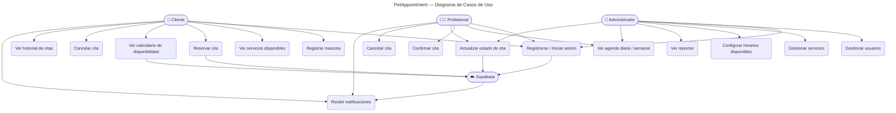
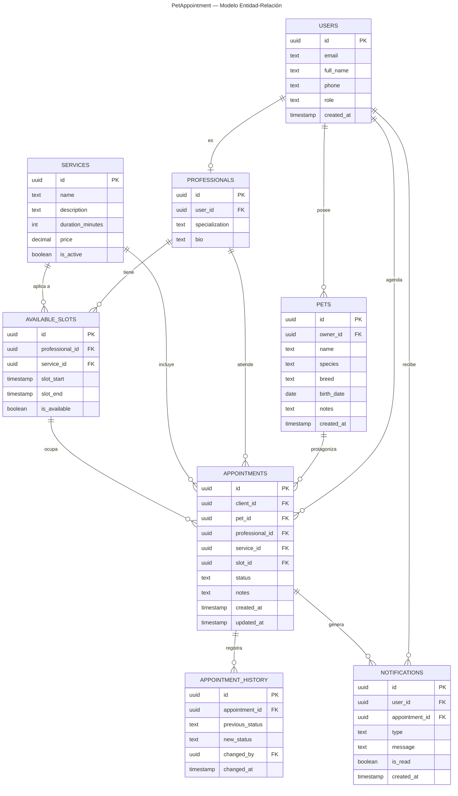
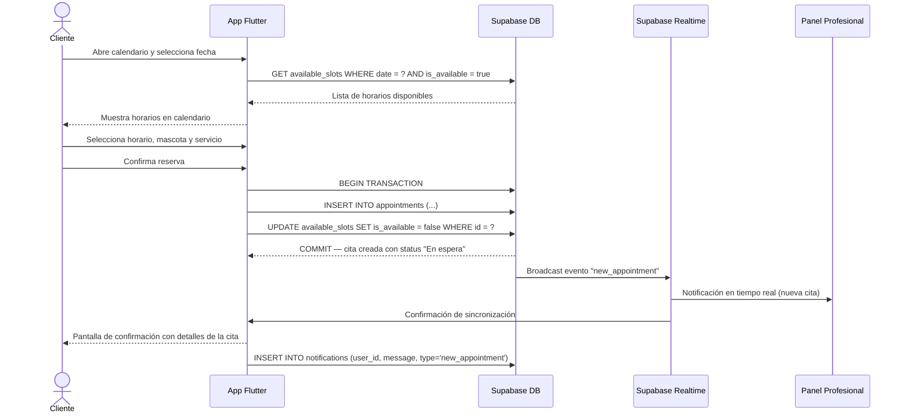
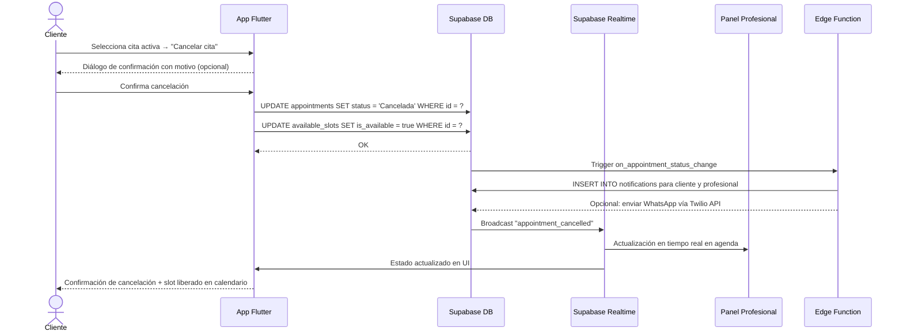
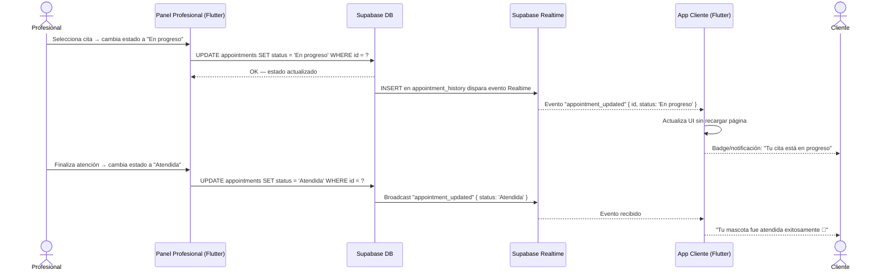
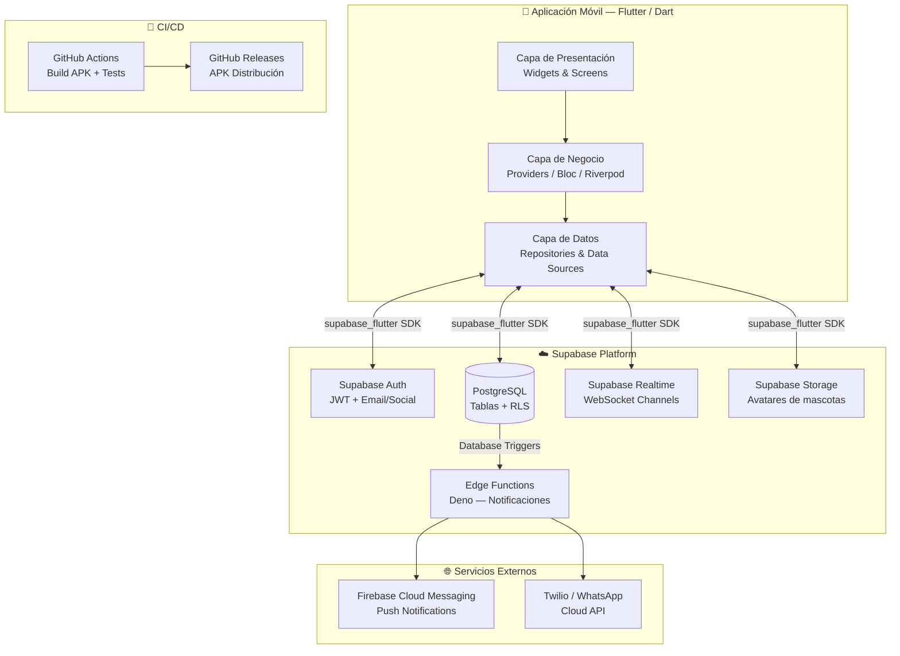
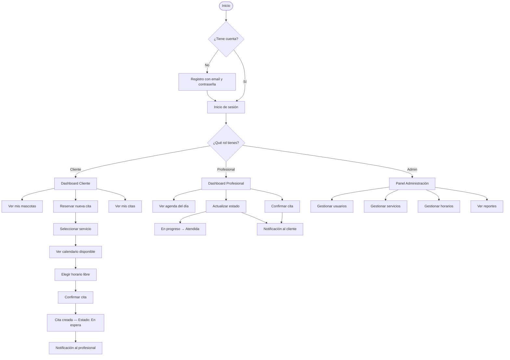

## 4. Diagramas

> **Nota:** Todos los diagramas están escritos en sintaxis Mermaid y se renderizan automáticamente en GitHub, GitLab y herramientas compatibles.

### 4.1 Diagrama de Casos de Uso

### 4.2 Diagrama Entidad-Relación (ERD)

### 4.3 Diagrama de Secuencia — Reservar una Cita

### 4.4 Diagrama de Secuencia — Cancelar una Cita

### 4.5 Diagrama de Secuencia — Actualización de Estado en Tiempo Real

### 4.6 Diagrama de Arquitectura Técnica

### 4.7 Flujo General del Sistema

---

